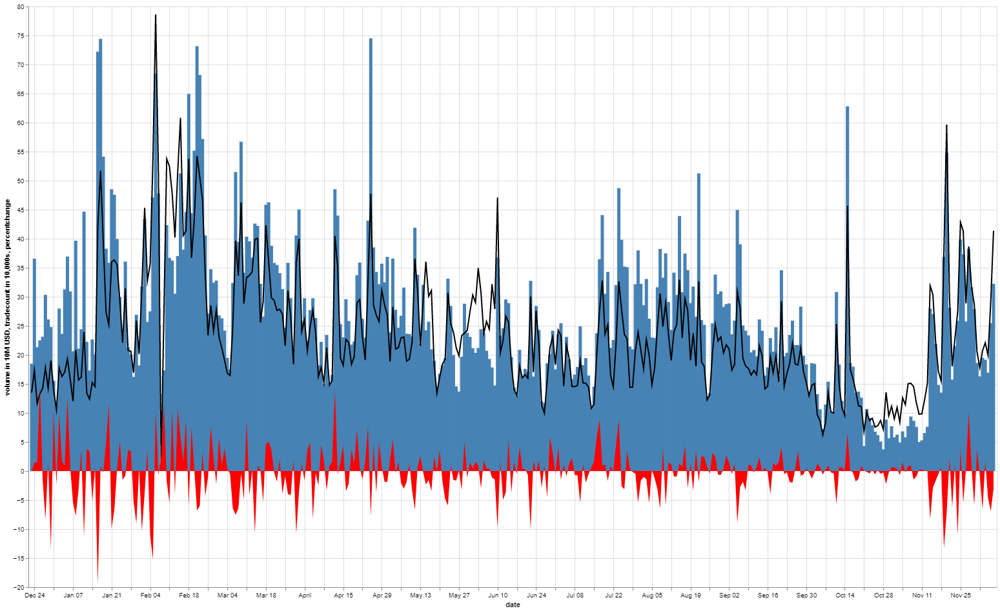
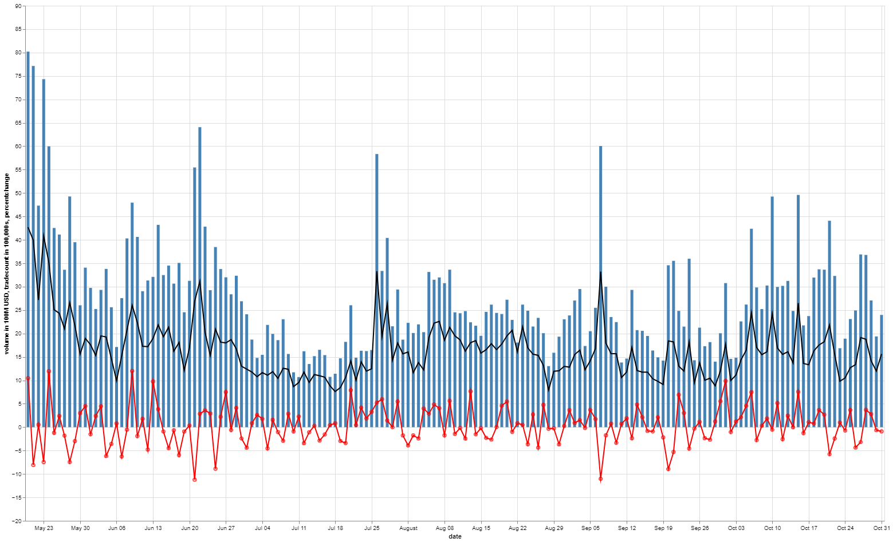

# Don't Get Rekt

This is bad okay.

## Project Goals

/// michael enter goals here ///

## Cleaning of Data

Cleaning of data feat. TA Hero Gunawan

## Visualisation of Data

### Process of Visualisation

Visualsation of Data was done with mostly hvplot, however the imported library Altair was used as it provided a more efficient way of combined plots together.
Documentation of Altair can be found [here.](https://pypi.org/project/altair/)

The installation is simply 

<code> 
    
    pip install altair
  
    <code/>

For example, bar graphs can easily be made with negative values containing different colours to notate whether the value was negative or positive.
The code is simply a conditional value on whether the value is negative or positive. 

<code> 
   
    import altair as alt
    
    source = trade

    alt.Chart(source).mark_bar().encode(
    
    x="date",
    
    y="percentchange",
    
    color=alt.condition(
        
    alt.datum.percentchange > 0,
        
    alt.value("steelblue"),# The positive color
       
    alt.value("orange")  # The negative color
    )

    ).properties(height = 700, width=1500)' <code/>

Altair also allows for easy combining of graphs. Combining a line, scatter, area, and area graphs into a simple graph was a simple defining of the plot, followed by the addition numeric function.

<code>
    base = alt.Chart(source).encode(x='date')

    bar = alt.Chart(source).mark_bar().encode(
    
    x="date:T",
    
    y="volume in 10M USD",
    
    color=alt.condition(
        
    alt.datum.y > 0,
        
    alt.value("steelblue"),  # The positive color
        
    alt.value("steelblue")  # The negative color
    
    )

    ).properties(width=1500)

    line =  base.mark_line(color='black').encode(
    
    y='tradecount in 10,000s'

    )

    line2 = base.mark_area(color = 'red').encode(
    
    y='percentchange'

    )

    (bar + line + line2).properties(width=1500, height = 900)
    <code/>
    

### Plots 

An OHLC representation of Bitcoin prices in USD from Binance from the 1/8/2017 to 31/10/2021. Even though this can be easily found from an exchange, the representation here allows for future slicing of data.

A simple hvplot was used to create this graph. 

<code>
    
    ohlc = prices1.hvplot.ohlc(ylabel = "close", grid = True, xaxis = None, width = 1500)
    
    
<code/>
    

Using the RangeToolLink plugin from the Holoviews Library, we are able to create a combined representation along with volume, and a small scrollable overlay capable of zooming.

<code>
    
    from holoviews.plotting.links import RangeToolLink
    
    ohlc = prices1.hvplot.ohlc(ylabel = "close", grid = True, xaxis = None, width = 1500)

    overview = prices1.hvplot.ohlc(yaxis = None, height = 150, width = 1500)

    volume1 = prices1.hvplot.step("date", "volume", height = 100, xaxis = None, width = 1500)

    RangeToolLink(overview.get(0), ohlc.get(0))

    layout = (ohlc + overview + volume1).cols(1)

    layout.opts(merge_tools = False)

    
<code/>
    

    
And early representation of our data, from the period of August 2017 to December 2018. From this graph we can see that as trading count increases, volume increases in correlation. The change in price also reflects this. This shows shallow market depth and a lack of liquidity, a sign of an immature market. This allows for the "whales" to control the swings through coordinated sells and buys. 
    

    
A representation of the bear market following the 2017-2018 bull cycle. This graph shows the trade volume from 2018 - 2020. The results are similar here, with the largest spike being March 14, where the price of Bitcoin dropped a staggering 40% in a single day. 
    
    

    
2020 onwards to October 2021. This bull cycle shows a maturing market compared to the 2017 bull. The swings are smaller with larger trade volume. This shows greater market depth and liquidity. 
Here a scatter + line plot was used to plot the price % change. An area graph would have covered the data slightly.
A simple addition of code was used to add a scatter to the line to see the points more clearly.
<code> 
    
    volume_5 = vol3.loc["2021-05-20":"2021-10-31"]

    volume_5.reset_index(inplace = True)

    source = volume_5

    base = alt.Chart(source).encode(x='date')

    bar = alt.Chart(source).mark_bar().encode(
   
    x="date:T",
   
    y="volume in 100M USD",
    
    color=alt.condition(
        
    alt.datum.y > 0,
       
    alt.value("steelblue"),  # The positive color
       
    alt.value("steelblue")  # The negative color
   
    )

    ).properties(width=1500)

    line =  base.mark_line(color='black').encode(
   
    y='tradecount in 100,000s'

    )

    point2 = base.mark_line(color='black').encode(
    
    y='tradecount in 100,000s'

    )
    

    line2 = base.mark_line(color = 'red').encode(
   
    y='percentchange'

    )    

    point = base.mark_point(color = 'red').encode(
    
    y='percentchange'

    )

    (bar + line + line2 + point).properties(width=1500, height = 900) <code/>
    
    
From these visual representations we can gather that the market is maturing, and that volatility while still high should be less than the previous years. This is due to a rise in liquidity and more institutional interest in cryptocurrencies. However, this also means that the benefits of extremely volatile upswings will also be lessened, and that the days of Bitcoin going from $1 to $20,000 are incredibly unlikely to return. On the positive side (unless you are short BTC), it means that the bear market will be less volatile, as evident the 2018 bear market caused an almost -90% change to Bitcoin's price, while the bear market of 2021 moved the price ~-50%.
  
    
    

     
   
