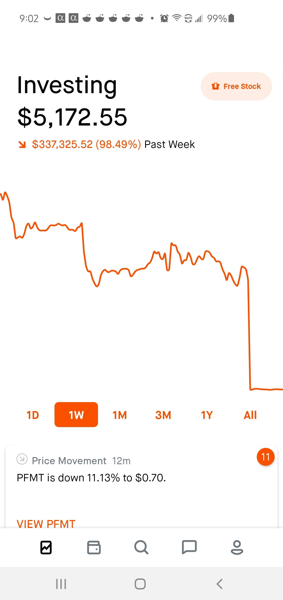
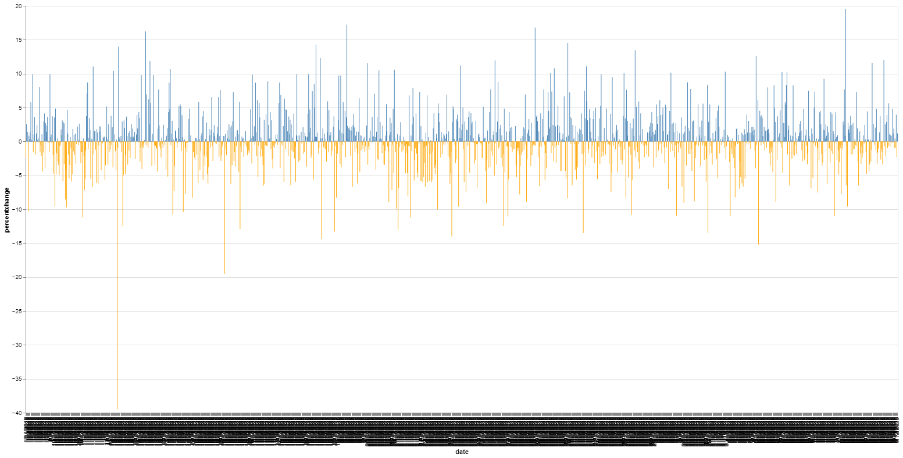
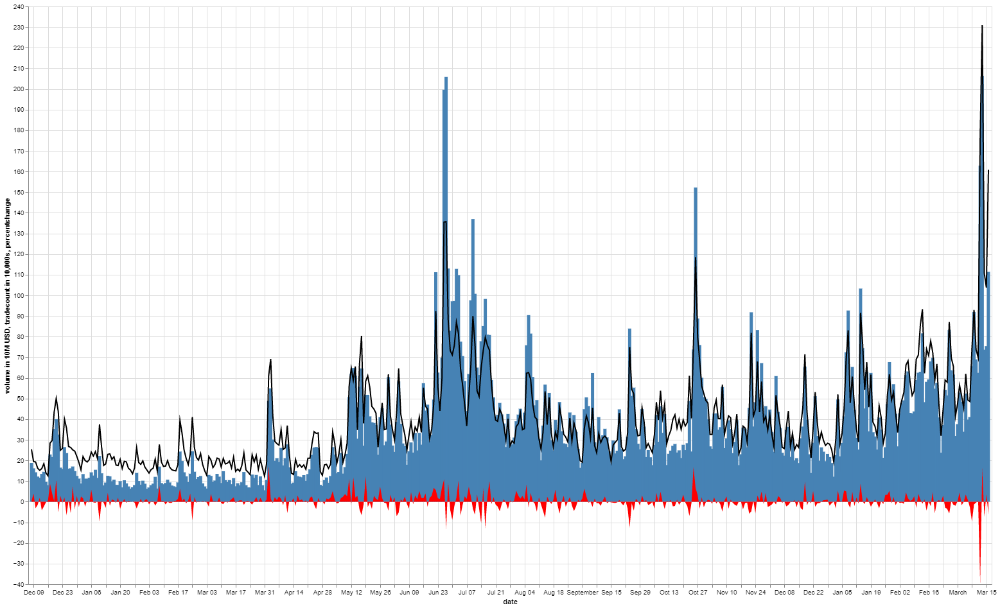
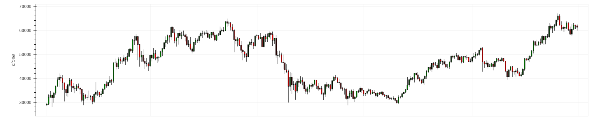
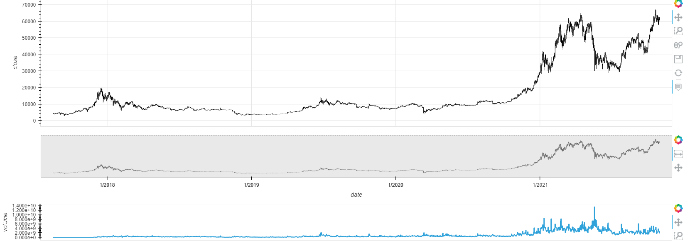

# Don't Get Rekt

This is bad okay.

## Project Goals

/// michael enter goals here ///

## Cleaning of Data

Cleaning of data feat. TA Hero Gunawan

## Visualisation of Data

### Process of Visualisation

Visualsation of Data was done with mostly hvplot, however the imported library Altair was used as it provided a more efficient way of combined plots together.
Documentation of Altair can be found [here.](https://pypi.org/project/altair/)

For example, bar graphs can easily be made with negative values containing different colours to notate whether the value was negative or positive.
The code is simply a conditional value on whether the value is negative or positive. 

<code> 
    
    import altair as alt
    
    source = trade

    alt.Chart(source).mark_bar().encode(
    
    x="date",
    
    y="percentchange",
    
    color=alt.condition(
        
    alt.datum.percentchange > 0,
        
    alt.value("steelblue"),# The positive color
       
    alt.value("orange")  # The negative color
    )

    ).properties(height = 700, width=1500)' </code>

### Altair also allows for easy combining of graphs. Combining a line, scatter, area, and area graphs into a simple graph was a simple defining of the plot, followed by the addition numeric function.

<code>
    
    base = alt.Chart(source).encode(x='date')

    bar = alt.Chart(source).mark_bar().encode(
    
    x="date:T",
    
    y="volume in 10M USD",
    
    color=alt.condition(
        
    alt.datum.y > 0,
        
    alt.value("steelblue"),  # The positive color
        
    alt.value("steelblue")  # The negative color
    
    )

    ).properties(width=1500)

    line =  base.mark_line(color='black').encode(
    
    y='tradecount in 10,000s'

    )

    line2 = base.mark_area(color = 'red').encode(
    
    y='percentchange'

    )

    (bar + line + line2).properties(width=1500, height = 900)
    <code/>
    

### Plots 

### An OHLC representation of Bitcoin prices in USD from Binance from the 1/8/2017 to 31/10/2021. Even though this can be easily found from an exchange, the representation here allows for future slicing of data.

### A simple hvplot was used to create this graph. 

<code>
    
    ohlc = prices1.hvplot.ohlc(ylabel = "close", grid = True, xaxis = None, width = 1500)
    
    
<code/>
    

### Using the RangeToolLink plugin from the Holoviews Library, we are able to create a combined representation along with volume, and a small scrollable overlay capable of zooming.

<code>
    
    ## from holoviews.plotting.links import RangeToolLink
    
    ## ohlc = prices1.hvplot.ohlc(ylabel = "close", grid = True, xaxis = None, width = 1500)

    ## overview = prices1.hvplot.ohlc(yaxis = None, height = 150, width = 1500)

    ## volume1 = prices1.hvplot.step("date", "volume", height = 100, xaxis = None, width = 1500)

    ## RangeToolLink(overview.get(0), ohlc.get(0))

    ## layout = (ohlc + overview + volume1).cols(1)

    ## layout.opts(merge_tools = False)

    
<code/>
    
    

     
   
