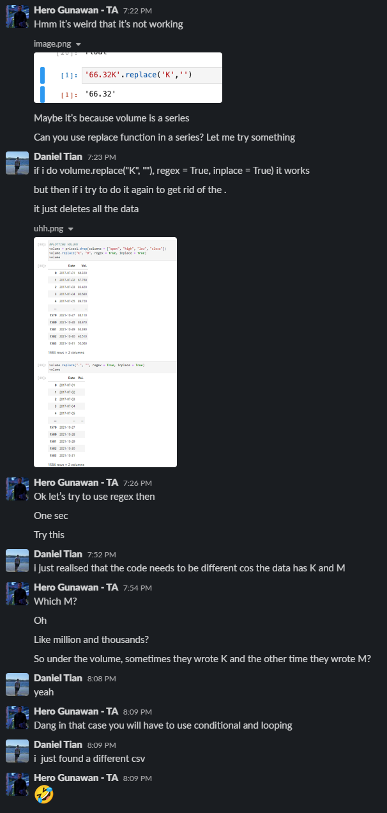

# Don't Get Rekt

this is bad.

## Project Goals

/// michael enter goals here ///

## Cleaning of Data

Cleaning of data feat. TA Hero Gunawan
## Visualisation of Data

Visualsation of Data was done with mostly hvplot, however the imported library Altair was used as it provided a more efficient way of combined plots together.
Documentation of Altair can be found [here.](https://pypi.org/project/altair/)

For example, bar graphs can easily be made with negative values containing different colours to notate whether the value was negative or positive.
The code is simply a conditional value on whether the value is negative or positive. 

<code> 
    
    import altair as alt
    
    source = trade

    alt.Chart(source).mark_bar().encode(
    
    x="date",
    
    y="percentchange",
    
    color=alt.condition(
        
    alt.datum.percentchange > 0,
        
    alt.value("steelblue"),# The positive color
       
    alt.value("orange")  # The negative color
    )

    ).properties(height = 700, width=1500)' </code>

